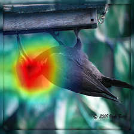
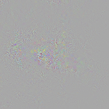
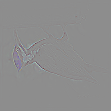
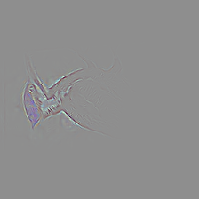
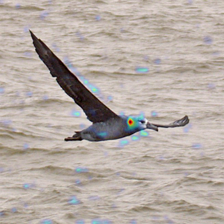
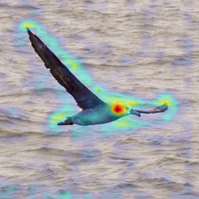
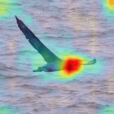
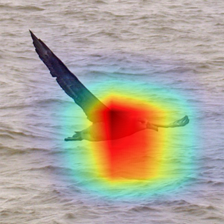

# Grad-CAM for Embedding Networks

PyTorch implementation of Generalizing GradCAM for Embedding Networks [ (paper)](https://arxiv.org/abs/2402.00909). Grad-CAM visualization code has been built on top of this [repo](https://github.com/kazuto1011/grad-cam-pytorch).

## Requirements

Python 2.7 / 3.+

```bash
$ pip install click opencv-python matplotlib tqdm numpy pillow
$ pip install "torch>=0.4.1" torchvision
```

## Basic usage
* Train an embedding model : [train_embedding_model.ipynb](https://github.com/pranavjadhav001/embedding-grad-cam-pytorch/blob/main/train_embedding_model.ipynb)
* Visualize : [Demo.ipynb](https://github.com/pranavjadhav001/embedding-grad-cam-pytorch/blob/main/Demo.ipynb)
## Demo 1

Generate all kinds of visualization maps given a torchvision model, a target layer, and images.

| ```Grad-CAM``` | ```Vanilla BackProp```  | ```Guided BackProp``` | ```Guided Grad-CAM``` |
| --- | --- | --- | --- |
|  |  |  |  |


## Demo 2

Generating Grad-CAM maps for different layers of ResNet-50.

|            Layer             |                                          ```layer1```                      |                     ```layer2```                      |                     ```layer3```                      |                     ```layer4```                   |
| :--------------------------: |  :---------------------------------------------------: | :---------------------------------------------------: | :---------------------------------------------------: | :---------------------------------------------------: |
| Grad-CAM [[1](##references)] |   |  |  |  |


## References

1. R. R. Selvaraju, A. Das, R. Vedantam, M. Cogswell, D. Parikh, and D. Batra. Grad-CAM: Visual Explanations from Deep Networks via Gradient-based Localization. In *ICCV*, 2017
2. J. T. Springenberg, A. Dosovitskiy, T. Brox, and M. Riedmiller. Striving for Simplicity: The All Convolutional Net. arXiv, 2014
3. M. D. Zeiler, R. Fergus. Visualizing and Understanding Convolutional Networks. In *ECCV*, 2013
4. Mudit Bachhawat , Generalizing GradCAM for Embedding Networks, 2024
